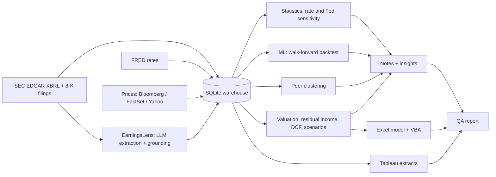

# StreetLens: US Financials research platform

StreetLens covers **JPMorgan Chase, Goldman Sachs, BlackRock and State Street** end to end on real data: it pulls audited financials and earnings releases from SEC EDGAR, rates from FRED and prices from Yahoo Finance (or a Bloomberg Terminal / FactSet when licensed); stores everything in a SQL warehouse; runs statistics, machine learning and peer clustering; values each company with the method its business model needs; reads every earnings filing with an LLM and keeps only figures it can verify word for word; and produces initiation notes, an Excel model with VBA, Tableau-ready extracts and a QA report. One command rebuilds it all in about 20 seconds.

```bash
python -m pip install -e ".[dev]"
PYTHONPATH=src python -m streetlens all --refresh            # live data -> everything in output/
PYTHONPATH=src python -m streetlens update --ticker JPM       # read the latest SEC earnings filings, revise the model
PYTHONPATH=src python -m streetlens sources                   # what is active here: Bloomberg, FactSet, LLM
python -m pytest -q                                           # 27 tests
```

After `pip install -e .`, the installed `streetlens` and `earningslens`
commands can be used without `PYTHONPATH=src`.

For the offline EarningsLens fixture:

```bash
earningslens demo
earningslens evaluate --gold data/gold.csv
```

> **Related project:** the earnings-extraction and grounding approach under
> `src/earningslens/` here is adapted from
> [EarningsLens](https://github.com/preekshitsaklani/EarningsLens), a standalone
> tool built for Indian bank earnings-call transcripts. This repo vendors its
> own copy, adapted for SEC filings, so StreetLens has no external dependency
> on that repo — but it's worth a look on its own.

## Results (live run, 4 October 2026)

| Company | Method | Price | 12-month target | Total return | Rating |
| --- | --- | --- | --- | --- | --- |
| JPMorgan Chase | Residual income | $332.38 | $320 | -1.7% | HOLD |
| Goldman Sachs | Residual income | $902.56 | $615 | -29.6% | SELL |
| BlackRock | Two-stage DCF | $1,059.63 | $1,280 | +23.3% | BUY |
| State Street | Residual income | $175.96 | $155 | -9.8% | HOLD |

**Quantitative findings**

- **Rates:** JPMorgan is the clearest rates play: a 1 point rise in the 10-year Treasury yield has coincided with a +6.1% move relative to the market (t = 4.5, 260 weeks, Newey-West errors). State Street +4.8% (t = 2.1). Goldman Sachs and BlackRock show no significant link.
- **Fed sensitivity:** each 1 point year-on-year rise in the Fed funds rate has gone with about +7.5 points of net interest income growth at JPMorgan and State Street (68 quarters, t > 3). Goldman's net interest income shows no reliable link, consistent with a trading-driven balance sheet.
- **Forecasting, honestly:** over 150 walk-forward forecasts (2016-2026), a naive "next quarter grows like this quarter" baseline (mean absolute error 8.6 points) beat ridge regression (9.3) and gradient boosting (9.8). The models are reported, not used for estimates.
- **Peers:** clustering 29 US financials on two years of weekly returns shows the market trades BlackRock with private-markets firms (KKR, Apollo, Blackstone), not traditional fund managers, and State Street with banks, closest to Northern Trust.
- **Valuation vs consensus:** Goldman's target sits far below the average analyst target; the note shows the price implies a sustainable RoTCE well above its FY2021-25 average.

## How the JD requirements are met

| JD requirement | Where |
| --- | --- |
| Interest in markets and investment research | Four initiation notes, a sector note, earnings-update notes, consensus comparison |
| Quantitative, analytical, problem-solving skills | Residual income and DCF models, reverse valuation solver, regressions, backtest, clustering |
| Advanced Excel, financial modelling, VBA | `US_Financials_Coverage_Model.xlsx` (live formulas, scenario selector, analysis sheets); `ScenarioRunner.bas` (RunScenarios, ExportScenariosForTableau) |
| Python, SQL, VBA | Python throughout; SQLite warehouse with window-function views (`sql/views.sql`, `sql/analysis.sql`); VBA macros |
| Bloomberg, FactSet | Optional adapters that switch on automatically (`bloomberg.py`, `factset.py`), one field map (`companies/_data_fields.json`), `Terminal_Formulas.xlsx` with BDP/BDH/FDS formulas |
| Analyse complex datasets, actionable insights | 18 years of quarterly SEC data, 5 years of weekly prices and rates, 29-stock peer universe; findings written as plain-English insights |
| Attention to detail, accuracy under deadlines | `output/qa_report.md` (9 checks), Excel-vs-Python parity, grounding check, look-ahead check, 27 tests, one-command rebuild |
| Machine learning, statistics, data analysis | OLS with Newey-West errors, rolling betas, ridge and gradient boosting with walk-forward validation, hierarchical clustering, MDS |
| AI/LLM tools for research automation | EarningsLens: SEC filings fetched automatically, LLM (or regex) extraction, word-for-word grounding, logged driver changes, target-price bridge |
| Tableau | `output/tableau/*.csv` extracts and `tableau/BUILD_GUIDE.md` (four-sheet dashboard, about an hour in Tableau Public) |

## Pipeline



## Outputs (`output/`)

`*_initiation.md` (four notes with quant view), `US_Financials_sector_note.md` (findings), `*_update.md` (from SEC filings), `US_Financials_Coverage_Model.xlsx`, `Terminal_Formulas.xlsx`, `streetlens.db` (SQL warehouse), `tableau/*.csv`, `qa_report.md`.

The `output/` directory is generated and intentionally ignored by Git. The
checked-in `companies/`, `snapshots/`, `data/`, `sql/`, `src/`, and `tests/`
directories are the inputs required to rebuild it. In particular,
`snapshots/market.json` is retained so offline builds and tests work after a
fresh clone.

## Setup notes

- `.env` (copy `.env.example`): `SEC_USER_AGENT` (your name and email, required by the SEC), optional LLM key (Gemini free tier or local Ollama), optional `FACTSET_USERNAME_SERIAL` and `FACTSET_API_KEY`. Never commit `.env` or paste keys anywhere public.
- **Excel and VBA (Windows):** open the model, Alt+F11 > File > Import File > `src/streetlens/ScenarioRunner.bas`, save as .xlsm, run `RunScenarios`, then `ExportScenariosForTableau`.
- **Bloomberg:** on a Terminal PC, install `blpapi`, run `sources`, then `all --refresh`. Check field codes with `FLDS <GO>`. Vendor data is for the licensed user only: publish only free-source data (`DATA_SOURCE=yahoo`).

## Limitations

- Statistical relationships are historical associations over the sample, not causal estimates; the notes state t-statistics and sample sizes.
- Fourth quarters are derived as full year minus the first three (flagged `q4_derived` in the data).
- Bloomberg and FactSet adapters follow the vendors' published APIs but were not run without credentials.
- Student research project, not investment advice.
